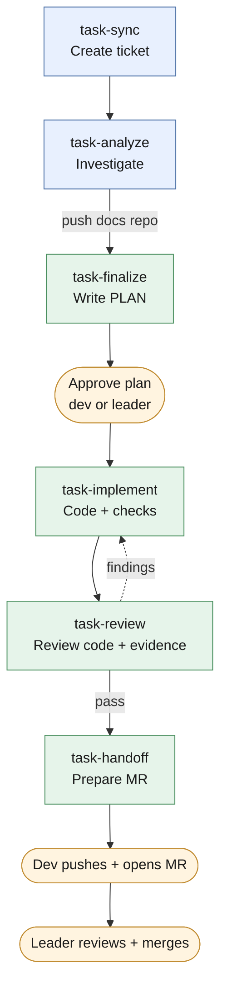

# ticket-workflow-kit

Bộ skill `task-*` cho AI coding agent (Codex, Claude Code): đưa một yêu cầu (file hoặc mô tả trong chat) qua **sync → analyze → finalize → implement → review → handoff** thành một branch đã kiểm chứng, sẵn sàng tạo MR. Chỉ cần Git và Node.js.



## Nguyên tắc

- **Agent làm, người quyết.** Agent điều tra, lập plan, code, chạy test, soạn nội dung MR. Developer chọn hướng; plan phải được developer hoặc leader duyệt trước khi code; developer tự push và tạo MR; leader merge.
- **Không có evidence thì không qua cổng.** Trạng thái `verified` / `reviewed` / đã bàn giao do helper tính từ kết quả check đã chạy thật, khớp đúng code và môi trường hiện tại. Không ai được tự khai "pass".
- **Hồ sơ ticket nằm ở repo Git riêng**, chia sẻ bằng commit/push: `TASK.md`, `PLAN.md`, `CHECKS.md`, nguồn yêu cầu trong `request/`, lịch sử bất biến trong `.workflow/`. Không sửa tay.
- **Guardrails.** Runtime hooks (Codex, Claude Code) và Git hooks chặn lộ secret, bypass hook, agent push/tạo MR, metadata Git không đúng quy ước.

## Bắt đầu nhanh

Cần Git, Node.js 22.12+ (nhánh 22) hoặc 24+, và một checkout của repo hồ sơ. Không cần `package.json`, dependency hay token.

```bash
# tại root repo source
node .agents/workflow/task.mjs setup     # tạo cấu hình máy, bật Git hooks, liên kết skills cho Claude Code
# điền docsRepo trong .agents/workflow.local.json
node .agents/workflow/task.mjs doctor    # kiểm tra môi trường
node .agents/workflow/task.mjs list      # xem ticket
```

Sau đó bật runtime hooks (Codex: `/hooks`; Claude Code: trust thư mục project) và gọi skill: `$task-sync` (Codex) hoặc `/task-sync` (Claude Code), các bước sau kèm ticket ID, ví dụ `/task-analyze REQ-7`. Dùng `node .agents/workflow/task.mjs status <ticket>` để biết bước tiếp theo.

Hướng dẫn đầy đủ: [WORKFLOW_SETUP.md](WORKFLOW_SETUP.md).

## Cấu trúc repo

| Đường dẫn | Nội dung |
|---|---|
| [.agents/skills/](.agents/skills/) | 6 skill của luồng `task-sync`, `task-analyze`, `task-finalize`, `task-implement`, `task-review`, `task-handoff`, và `task-retro` để nhìn lại một ticket |
| [.agents/workflow/](.agents/workflow/) | CLI `task.mjs`, thư viện helper, [CONTRACT.md](.agents/workflow/CONTRACT.md), tests |
| [.agents/workflow.config.json](.agents/workflow.config.json) | Cấu hình dùng chung của dự án (remote, base branch, nhánh bảo vệ…) |
| [.githooks/](.githooks/) | Git hooks (`pre-commit`, `commit-msg`, `pre-push`) |
| `.codex/hooks.json`, `.claude/settings.json` | Runtime hooks cho Codex và Claude Code |
| [AGENTS.md](AGENTS.md), [CLAUDE.md](CLAUDE.md) | Quy tắc làm ticket cho agent |
| [docs/](docs/) | Thiết kế: [ADAPTATION-DESIGN.md](docs/ADAPTATION-DESIGN.md), [TASK-SKILLS-BLUEPRINT.md](docs/TASK-SKILLS-BLUEPRINT.md) |

## Tài liệu

| Tài liệu | Dùng khi |
|---|---|
| [TASK-SKILLS-GUIDE.md](.agents/TASK-SKILLS-GUIDE.md) | Training team: vai trò, kiến trúc, từng bước workflow, tình huống đặc biệt, lỗi thường gặp |
| [WORKFLOW_SETUP.md](WORKFLOW_SETUP.md) | Đưa bộ kit vào repo và setup từng máy |
| [CONTRACT.md](.agents/workflow/CONTRACT.md) | Schema và gate chi tiết (nguồn chuẩn nếu khác guide) |
| [ADAPTATION-DESIGN.md](docs/ADAPTATION-DESIGN.md) | Vì sao bộ kit thiết kế như hiện nay |
| [TASK-SKILLS-BLUEPRINT.md](docs/TASK-SKILLS-BLUEPRINT.md) | Đặc tả đầy đủ để làm lại hoặc cải tiến |

## Kiểm thử

```bash
node --test ".agents/workflow/tests/*.test.mjs"
```
